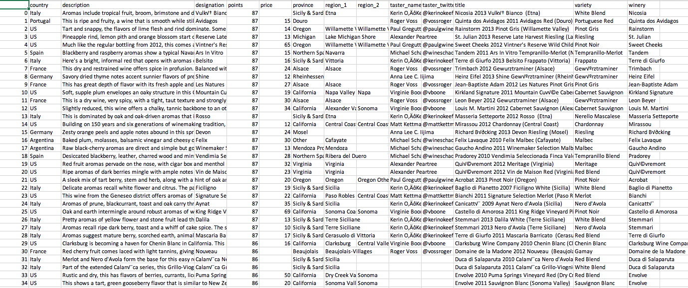
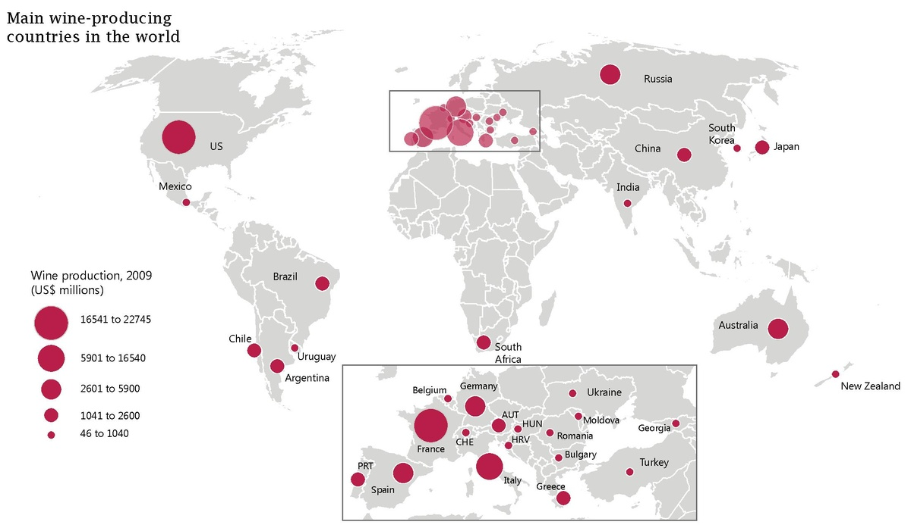
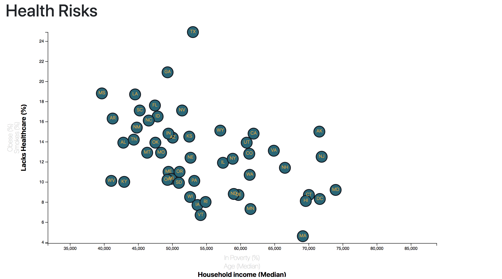
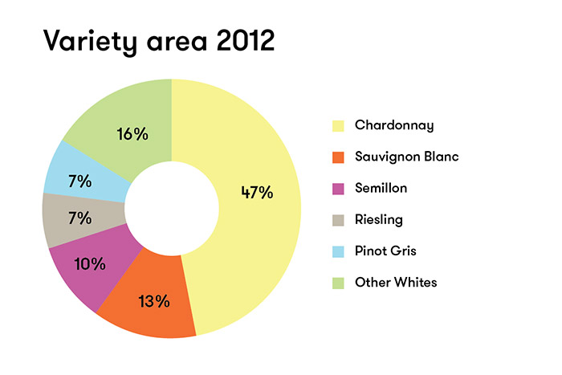
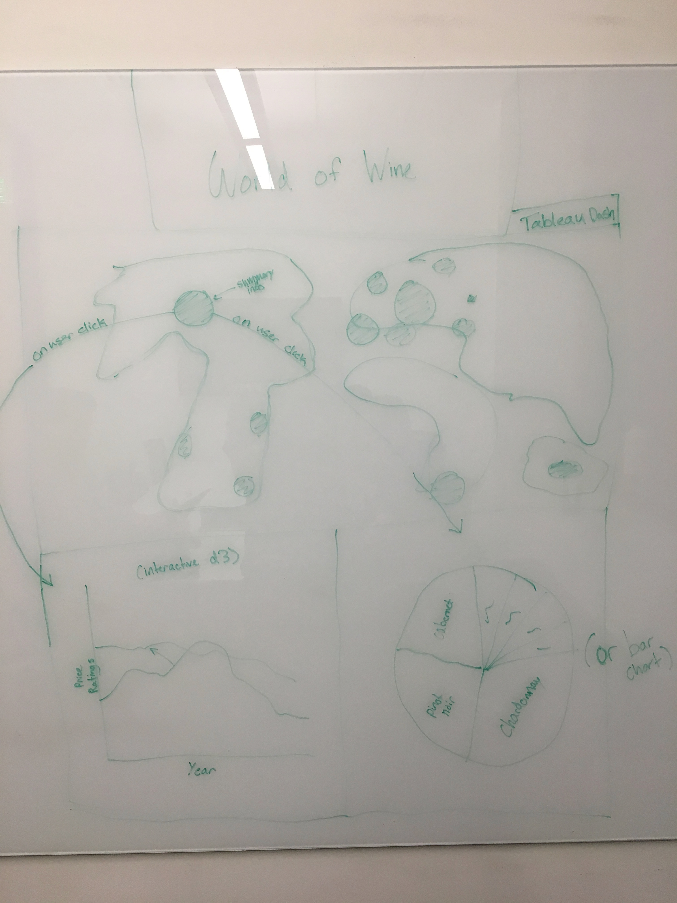

# UTA Data Bootcamp Project 2 - Analysis of Wine Ratings
-------------------------------------------------------------------------------
### Team Members: Ryan Frescas, Eric Staveley, Tony Jones, Eric Tonian
-------------------------------------------------------------------------------
## Project Proposal:
Continuing on Ryan/Eric T's ETL project *"Wine and Happiness"*, we are diving further into the great World of Wine! Using already scraped data from WineEnthusiast, we will be building a visual dashboard made up of a main 'World Wine Map' as well as graphs that will be generated from user selections on the map. These graphs will likely be an interactive d3 graph that allows for user to compare different variables (price vs rating, region vs. rating, etc.) and a pie/bar breakdown of type of wine (cab sauv, red blend, etc.). We may also make a separate Tableau dashboard if we have some extra time.

#### Dataset:
Wine Reviews - 130k wine reviews with variety, location, winery, price, and description
https://www.kaggle.com/zynicide/wine-reviews

#### Inspiring Visualizations

 
#### Sketch of App Design

